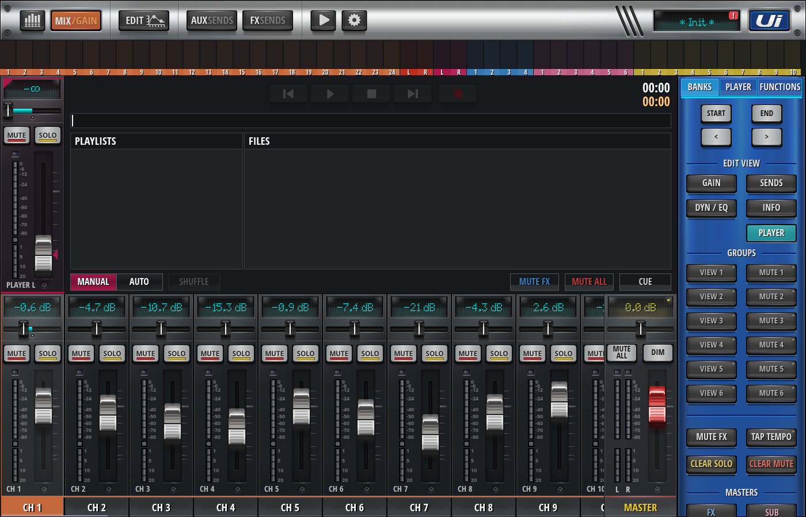
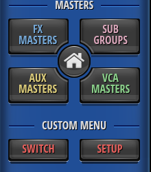
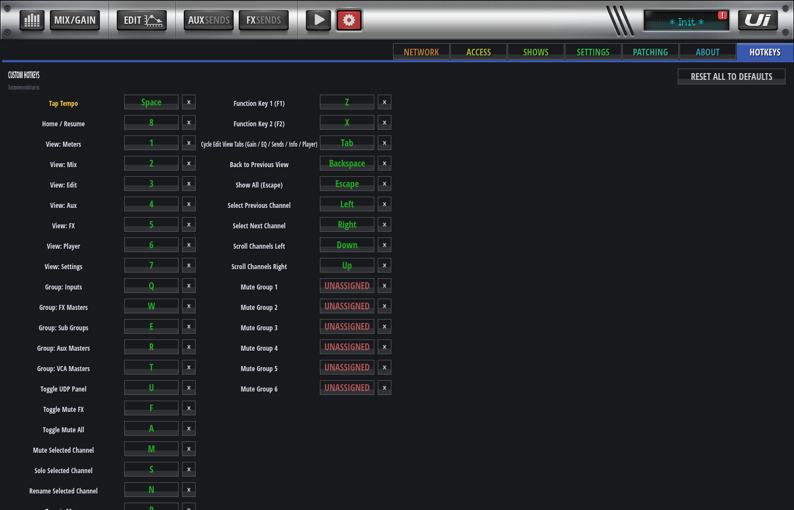
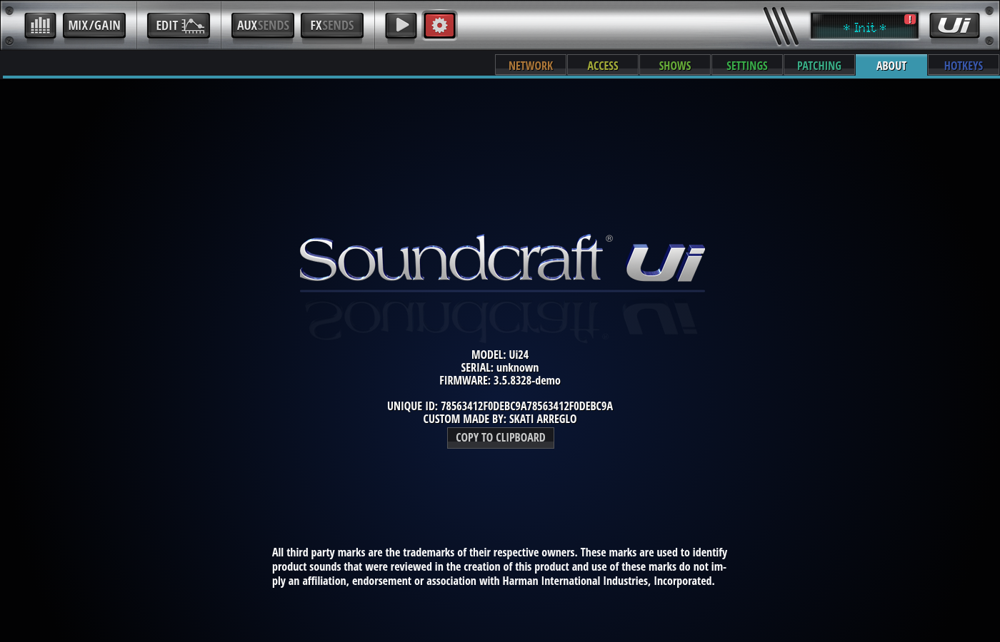
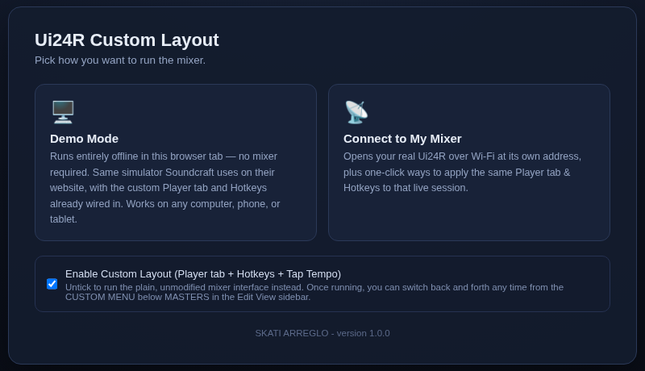

# Ui24R Custom Layout

A self-contained, offline-capable custom layout for Soundcraft's **Ui24R** web control
interface. Drop it next to the mixer's own files (or run it standalone in Demo Mode)
and it adds a working **Player** tab with its own volume fader, a fully rebindable
**Hotkeys** system with Tap Tempo, a quick-access **Custom Menu** right in the mixer's
own sidebar, and a personal credit line on the mixer's About page — all without
touching Soundcraft's original app files.

Custom made by **Skati Arreglo** — version 1.0.0.

[Download ZIP Here](https://github.com/arregloskati-hash/Ui24r_Custom_Layout/archive/refs/heads/main.zip)

## Features

### 1. Player tab with a real PLAYER L channel strip

The **Player** tab (added under Edit View, next to Gain / Sends / Dyn-Eq / Info) now
has its own full channel strip — fader, mute, solo, and VU meter — docked to the left,
wired straight to the mixer's real PLAYER L channel. No more jumping back to the main
mix view just to nudge the player's volume; it's right there while you browse
playlists and files.



### 2. Custom Menu in the Edit View sidebar

A **CUSTOM MENU** section sits right below MASTERS in the Edit View sidebar, styled to
match the mixer's own buttons:

- **SWITCH** and **SETUP** both take you back to the mode-picker (Demo Mode / Connect
  to My Mixer) screen, so you can change modes or turn the custom layout on/off without
  ever leaving the mixer's own screen.



### 3. Fully rebindable Hotkeys, including Tap Tempo

A dedicated **HOTKEYS** page under Settings lists every keyboard shortcut the app
recognizes, shows its current key, and lets you rebind any of them by clicking the key
badge and pressing a new one — including **Tap Tempo**, bound to the Space bar by
default.



### 4. A personal credit on the About page

The mixer's own Settings → About screen now shows a `CUSTOM MADE BY: SKATI ARREGLO`
line right under the UNIQUE ID, so it's always clear which mixer is running the
custom layout.



### 5. A simple, one-sentence welcome screen

Opening the layout drops you on a clean picker: Demo Mode (runs entirely offline) or
Connect to My Mixer, with a checkbox to turn the custom layout on or off. Your choice
is remembered, so next time it goes straight back in.



## How to use it

1. **Download this repository.** Click the green **Code** button on GitHub → **Download
   ZIP**, then unzip it anywhere on your computer.
2. **Open the `dist` folder.** Keep everything inside it together — the HTML file needs
   `vendor-app.js`, the `img1x/`, `fonts/`, and `js/` folders, and the two
   `ui24r-custom-*.js` files sitting right next to it.
3. **Double-click `Ui24R-Custom.html`.** It opens straight in your browser — no server,
   no install, no internet connection needed for Demo Mode.
4. **Pick a mode:**
   - **Demo Mode** — try everything out immediately, entirely offline.
   - **Connect to My Mixer** — type your real Ui24R's address (`10.10.2.1` on its own
     Wi-Fi hotspot, or your normal network address) to control your actual mixer, with
     one-click options to layer the same Player tab and Hotkeys on top of that live
     session.
5. **That's it.** Your choice is remembered automatically. To change it later, open the
   Edit View sidebar and look for **CUSTOM MENU** below Masters — SWITCH or SETUP both
   take you back to this picker screen.

Full details — including how to apply the custom layout permanently to your real
mixer with Tampermonkey — are in [`dist/README.txt`](dist/README.txt).

### Rebuilding from source

The actual customizations live in [`src/custom.js`](src/custom.js) and
[`src/hotkeys.js`](src/hotkeys.js). After editing either one, rebuild `dist/` with:

```
python3 src/build.py
```

A Playwright regression suite covering the Player tab, tab cycling, hotkeys, tap
tempo, the PLAYER L strip, and the About page credit line lives in
[`test/test.js`](test/test.js).

## Support this project

If this custom layout made your Ui24R workflow easier and you'd like to say thanks,
you can send a donation of any amount, in any currency, via PayPal:

**[paypal.me/ScottArreglo](https://paypal.me/ScottArreglo)**

Every bit is appreciated — thank you for checking this out!
